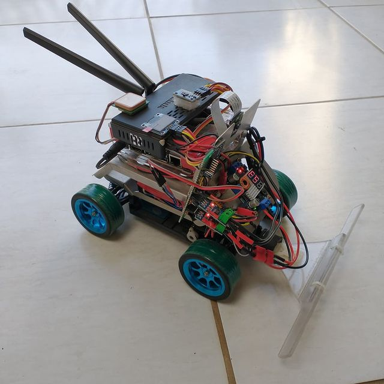
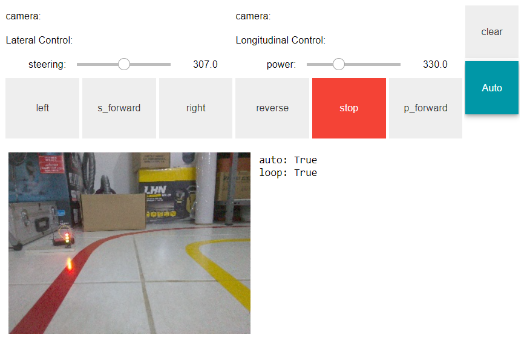
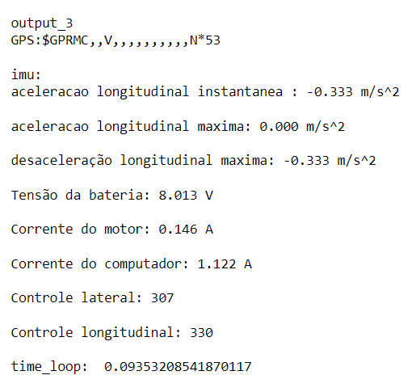
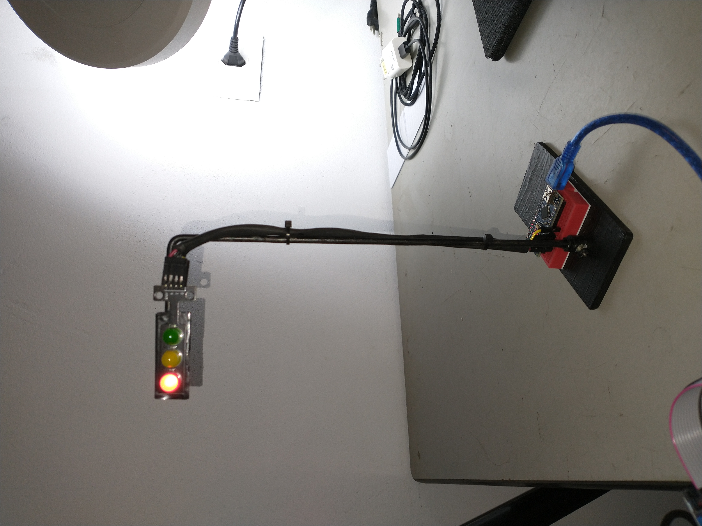

# FATEC_TCC_2022

Author_1: Wilson Queiroz de Oliveira 
Author_2: Miguel Balbastro Gomes 

## Dependencies for jetson nano

- jatpack 4.6 or new OS Ubunto 20.04 -> https://github.com/Qengineering/Jetson-Nano-Ubuntu-20-image
- sudo pip3 install Jetson.GPIO
- sudo pip3 install jupyter

- sudo apt-get install build-essential libi2c-dev i2c-tools python-dev libffi-dev
- sudo pip3 install PCA9685-driver

- sudo apt-get install libcanberra-gtk-module
- sudo apt-get install python3-setuptools
- ~/pyPS4Controller$ sudo python3 setup.py install
- sudo pip3 install pyPS4Controller
- sudo pip3 install ds4drv

- sudo pip3 install pyserial
- sudo pip3 install ADS1115
- sudo pip3 install mpu6050-raspberrypi
- sudo pip3 install board
- sudo pip3 install Adafruit-Blinka
- sudo pip3 install luma.core
- sudo pip3 install luma.oled
- sudo pip3 install natsort
- sudo pip3 install pillow

- gps uart permition: sudo chmod 666 /dev/ttyTHS1

## Test Vehicle

## HMI Manual Control Panel

## HMI Sensors data

## Color Detection

## traffic_sign 

## Dependencies for programing_examples/python_examples.ipynb

- miniconda
- conda create --name fatec_tcc_2022 python=3.6.9 ipykernel
- python -m ipykernel install --user
- conda install -c anaconda jupyter
- conda install -c conda-forge opencv
- conda install -c pytorch pytorch
- conda install -c anaconda pip
- pip install pillow
- pip install numpy --upgrade
- conda install -c pytorch torchvision
- pip install PyQt6
